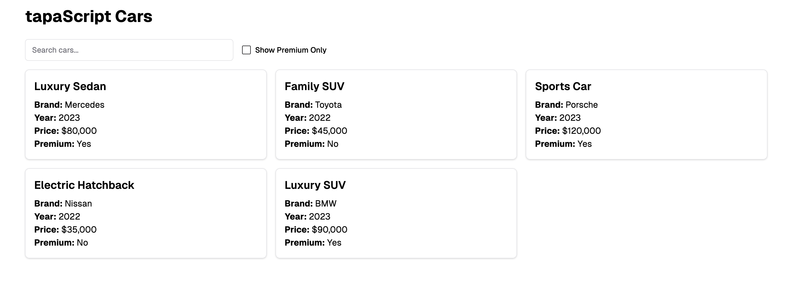
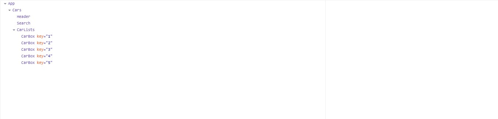

# tapaScript Cars

A simple web application for showcasing cars, built with a focus on filtering and displaying premium and non-premium cars. 

## Features

- Responsive Design: Ensures compatibility with various screen sizes.
- Card-Based Layout: Cars are displayed in an easy-to-read card format.

## How to run the project

To run this project locally, follow these steps:

1. **Clone the Repository**  

``` 
git clone https://github.com/sadia1993-design/learn-react-from-tapascript.git
```

2. Navigate to the project directory:

``` 
cd learn-react-from-tapascript
```

3. Install dependencies in package json file:

``` 
npm install
```

4. Start the development server:

``` 
npm run dev
```

5. Open the application in your browser at http://localhost:5173 .


## The screenshot of the UX design diagram



## React Dev Tools Screenshot



## Vercel Deployed Link of the development app

``` 
**[Learn React From TapaScript](https://learn-react-from-tapascript.vercel.app/)**
```

